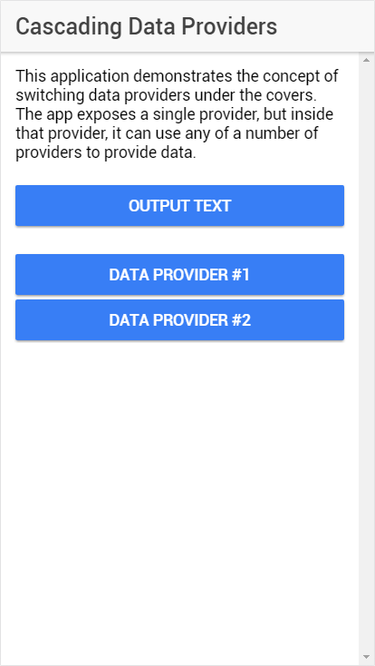

Ionic Cascading Providers
=========================

I am working on an Ionic 2 project, and for this project, the application needs to support a variety of data providers: online, offline, localstorage,  orsecurestorage. Basically, through a configuration setting or a hard-coded property in the application, the application needs to dynamically switch in the right provider based on the configuration. To prove one way to implement this, I created this sample project. It exposes a single Ionic provider that abstracts away two other providers. 

the `data.ts` provider sets a default provider in the constructor, then exposes a method called `setProvider` that enables another component to switch the provider.

	import { Injectable } from '@angular/core';
	import { Data1 } from './data-1';
	import { Data2 } from './data-2';
	
	@Injectable()
	export class Data {
	
	  public provider: any;
	
	  constructor(
	    private data1: Data1,
	    private data2: Data2
	  ) {
	    console.log('Data Provider: Initializing provider');
	    //Set the default provider
	    this.provider = this.data1;
	  }
	
	  public setProvider(provider: number) {
	    console.log('Data Provider: Entering setProvider()');
	    //Validate input
	    if (provider < 3) {
	      //switch to the selected provider
	      switch (provider) {
	        case 1:
	          console.log('Data Provider: Setting provider Data1');
	          this.provider = this.data1;
	          break;
	        case 2:
	          console.log('Data Provider: Setting provider Data2');
	          this.provider = this.data2;
	          break;
	      }
	    } else {
	      console.warn('Data Provider: Invalid provider number');
	    }
	  }
	
	}

Providers `data1.ts` and `data2.ts` both expose a single method: `test()` that simply writes some text to the console indicating which provider created the output.

	import { Injectable } from '@angular/core';
	
	@Injectable()
	export class Data1 {
	
	  constructor() {
	    console.log('Initializing Data-1')
	  }
	
	  test() {
	    console.log('Output from Data-1');
	  }
	}

When you run the application, it exposes several buttons. Click the **Output Text** button to call the `test()` method on the selected provider. Tap the **Data Provider #1** and **Data Provider #2** to switch output to the selected provider.

